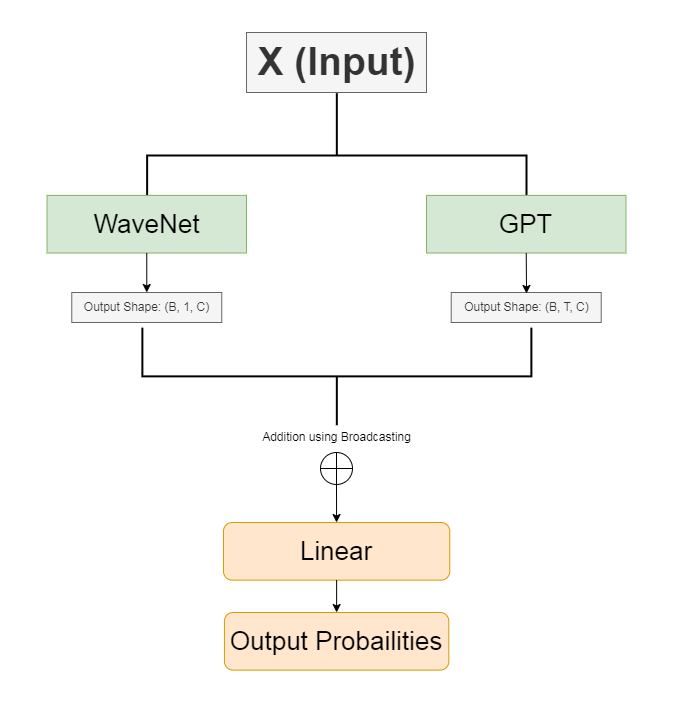
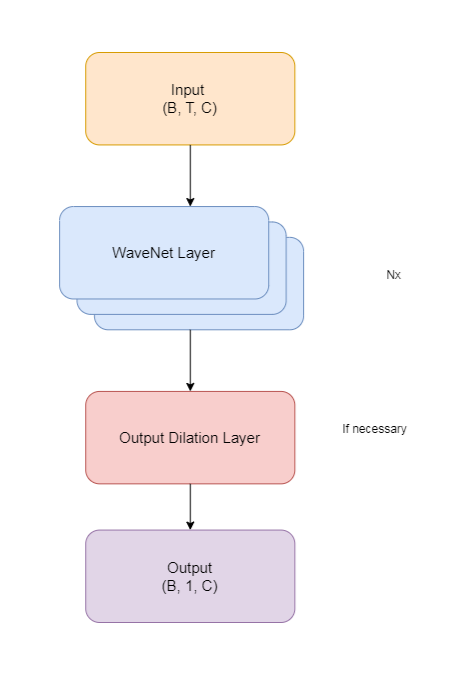

# WaveGPT: A GPT Model Enhanced with WaveNet

- GPT : GPT, or Generative Pre-trained Transformer, is a type of deep learning model known for generating human-like text based on input prompts. It uses a Transformer architecture and is trained on vast amounts of text data to understand and generate natural language

- WaveNet: WaveNet is a deep generative model developed by DeepMind for producing high-quality raw audio waveforms(here we are using wavenet for text data generation). It uses dilated convolutions to capture long-range dependencies in data, allowing it to capture more information to generate text with a long context.

## Architecture

### WaveGPT

    <figure>
         
    <figcaption>WaveGPT Architecture</figcation>
    </figure>

### GPT

    <figure>
         
    <figcaption >GPT Architecture  <i><a href="https://en.m.wikipedia.org/wiki/File:Full_GPT_architecture.png">image source</a></i> </figcation>
    </figure>

**Note:** We do not have the linear layer and output probablities at the end because we add the output of WaveNet.

### WaveNet

    <figure>
         
    <figcaption >WaveNet Architecture</figcation>
    </figure>

### WaveNet Layer

    <figure>
         
    <figcaption >A single WaveNet Layer</figcation>
    </figure>

 
The diagram above illustrates the architecture of WaveGPT. The process involves:

1. **Input Sequence**: The input sequence of shape (B, T).
2. **Embedding Layer**: Converts the input sequence into embeddings of shape (B, T, C).
3. **WaveNet Block**: Processes the embeddings using dilated convolutions and produces an output of shape (B, 1, C).
4. **Transformer Block**: Processes the embeddings using multihead masked attention and produces an output of shape (B, T, C).
5. **Broadcasting and Addition**: The WaveNet output is broadcasted and added to the Transformer output, resulting in a shape of (B, T, C).
6. **Linear Layer**: The combined output is passed through a linear layer, producing logits of shape (B, T, vocab_size).
7. **Output Probabilities**: The final output probablities after applying softmax.

## Data

The data used to train the model is [OpenWebText Corpus](https://huggingface.co/datasets/Skylion007/openwebtext) that was used by used by OpenAI to train [GPT2](https://d4mucfpksywv.cloudfront.net/better-language-models/language_models_are_unsupervised_multitask_learners.pdf). For this project only first 250,000 documents have been taken. The data text file has not been uploaded to this repository as it is more than 1GB. Please refer to `data.py` to download the dataset to your local machine.