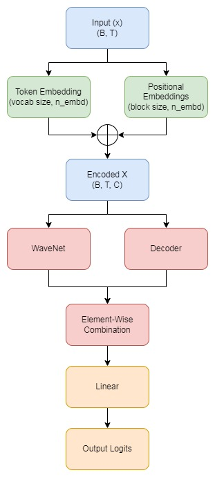
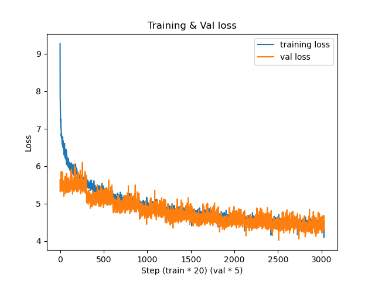
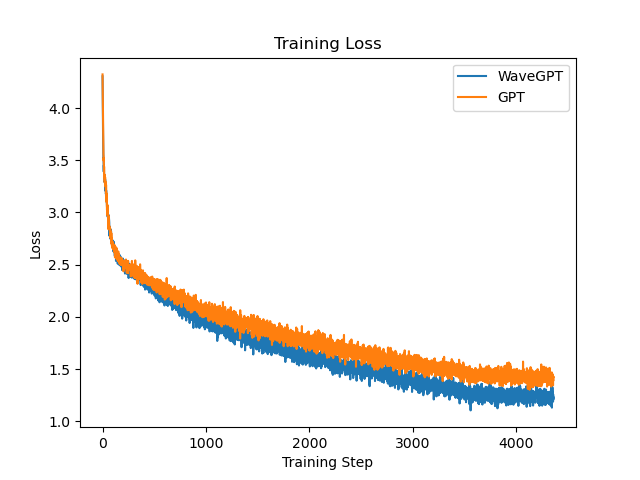
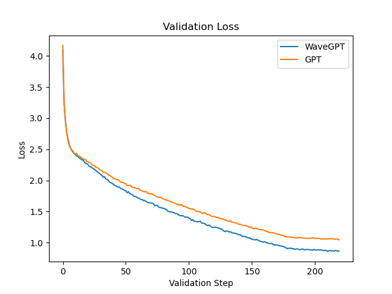

# WaveGPT: A GPT Model Enhanced with WaveNet

# Contents
- [Introduction](#Introduction)
- [Archicture](#architecture)
- [Data](#data)
- [Usage](#usage)
- [Contribution](#contributing)


## Introduction

A WaveGPT is a mini-gpt model enhaced with the use of a wavenet.

#### What is a GPT?  
 GPT, or Generative Pre-trained Transformer, is a type of deep learning model known for generating human-like text based on input prompts. It uses a Transformer architecture and is trained on vast amounts of text data to understand and generate natural language

#### What is a WaveNet?  
 WaveNet is a deep generative model developed by DeepMind for producing high-quality raw audio waveforms(here we are using wavenet for text data generation). It uses dilated convolutions to capture long-range dependencies in data, allowing it to capture more information to generate text with a long context which are the tokens from previous context.


## Architecture

### WaveGPT
<br>
    

### Element wise Combination

We add a trainable parameter $\alpha$ to allow the model to dynamically adjust the contributions of the Decoder and WaveNet components during training. 

$$\text{logits} = (g(x) \cdot \alpha) + (h(x) \cdot (1 - \alpha))$$

where `g(x)` is the output from Decoder and `h(x)` is output from the WaveNet  

The diagram above illustrates the architecture of WaveGPT. The process involves:

1. **Input Sequence**: The input sequence of shape (B, T).
2. **Embedding Layer**: Converts the input sequence into embeddings of shape (B, T, C).
3. **WaveNet Block**: Processes the embeddings for previous tokens using dilated convolutions and produces an output of shape (B, 1, C).
4. **Transformer Block**: Processes the embeddings using multihead masked attention and produces an output of shape (B, T, C).
5. **Broadcasting and Addition**: The WaveNet output is broadcasted and added to the Transformer output, resulting in a shape of (B, T, C).
6. **Linear Layer**: The combined output is passed through a linear layer, producing logits of shape (B, T, vocab_size).
7. **Output Probabilities**: The final output probablities after applying softmax.


## Data

The data used to train the model is [OpenWebText Corpus](https://huggingface.co/datasets/Skylion007/openwebtext) that was used by used by OpenAI to train [GPT2](https://d4mucfpksywv.cloudfront.net/better-language-models/language_models_are_unsupervised_multitask_learners.pdf). For this project only first 250,000 documents have been taken. The data text file has not been uploaded to this repository as it is more than 1GB. Please refer to `data.py` to download the dataset to your local machine.  

A character level language model was also trained on [Tiny Shakespeare](https://raw.githubusercontent.com/karpathy/char-rnn/master/data/tinyshakespeare/input.txt) dataset using character level tokenization with training dataset containing 80% of text and validation dataset being 20% of the dataset.

## Results

### OpenWebText

The model was trained for `10 epochs` with `6064 steps` each i.e `24,838,144 tokens` per epoch with a `constant learning rate of 3e-4`. Here are the results:



The model is not overfitting but can be improved with hyperparameters or with learning rate scheduler.

### Shakespeare Dataset

The following is a comparision between `WaveGPT` and `GPT` character level language model on `Tiny Shakespeare` dataset.   
Both models were trained for `10 epochs` with `436 steps` each i.e. `892928` tokens. WaveGPT also takes previous tokens into consideration. The learning rate was `3e-4` for first 7 epochs and `3e-5` for rest of training.

#### Training Loss comparision


#### Validation Loss comparision


There is a significant different in the losses.


## Usage

To train your own WaveGPT model, please refer to `main.py`. To train a GPT along with WaveGPT to compare both models on your dataset, please refer to `compare.py`. 

Use the saved metrics tensors in `artifacts` folder to plot graphs and evaluate your model.
```python
PATH = 'metrics-path'
if os.path.exists(PATH):
    metrics = torch.load(PATH)
    metrics = {key:value.tolist() for key, value in metrics.items()}
metrics.keys()

# Output if you run compare.py: dict_keys(['gpt_tl', 'gpt_vl', 'gpt_ta', 'gpt_va', 'wave_tl', 'wave_vl', 'wave_ta', 'wave_va'])
# Output if you run wgpt_trainer.py: dict_keys(['tl','vl','ta','va'])

# t stands for train
# v stands for validation
# l stands for loss
# a stands for accuracy
```


## Contributing

Contributions are welcome, just raise a pull request. Feel free to raise an issue if you encounter an error or bug!